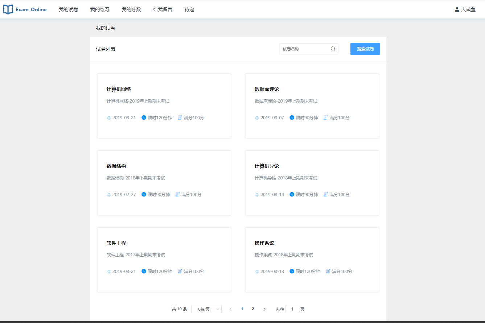
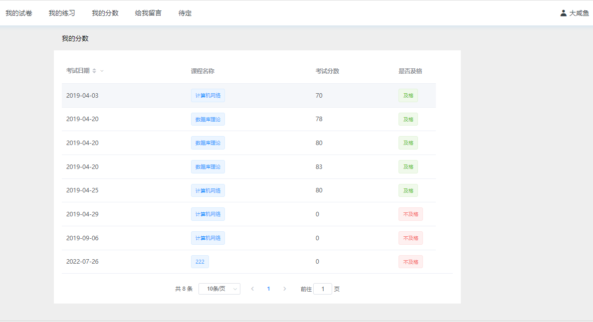
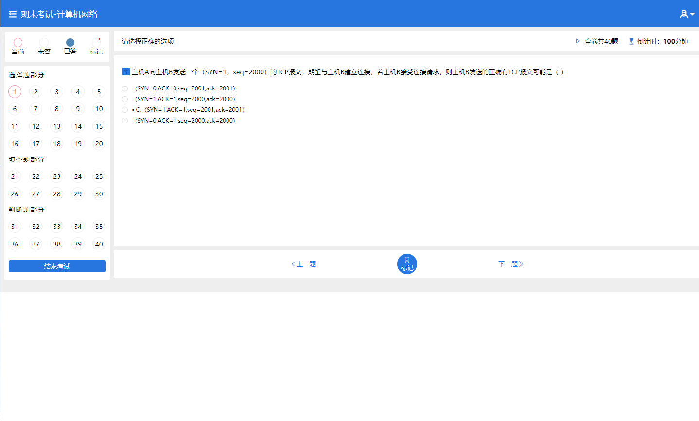
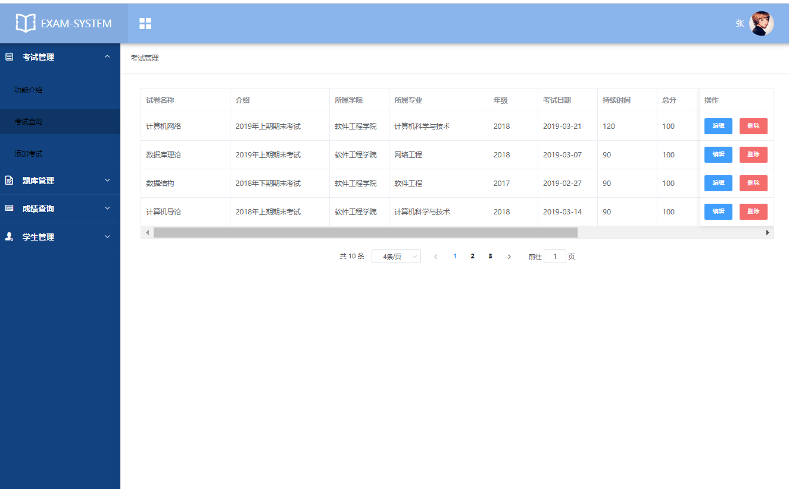
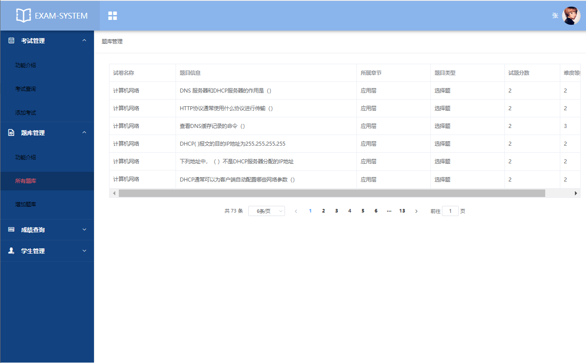
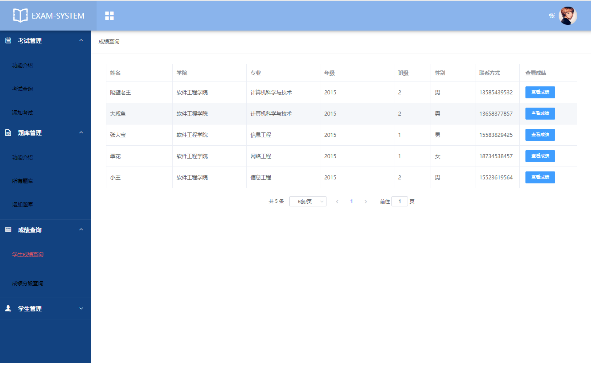
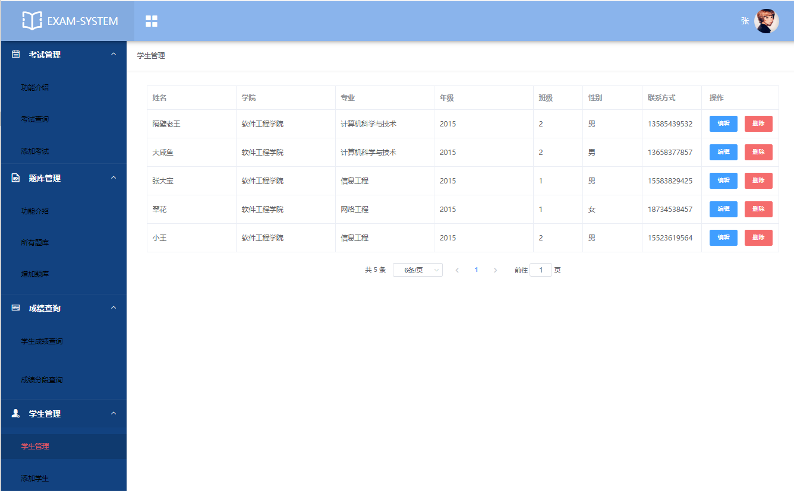
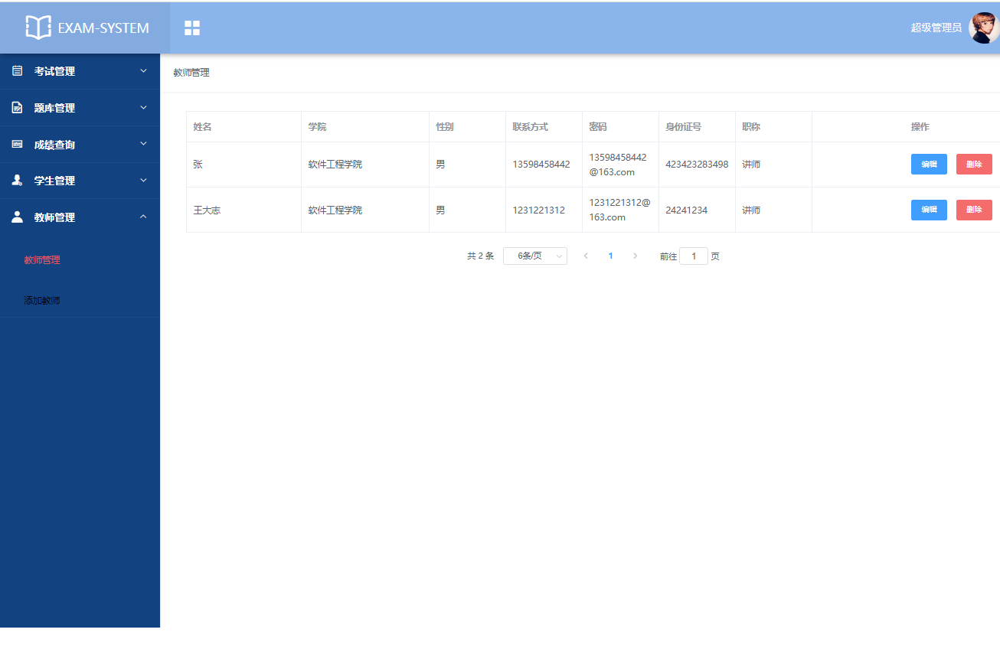
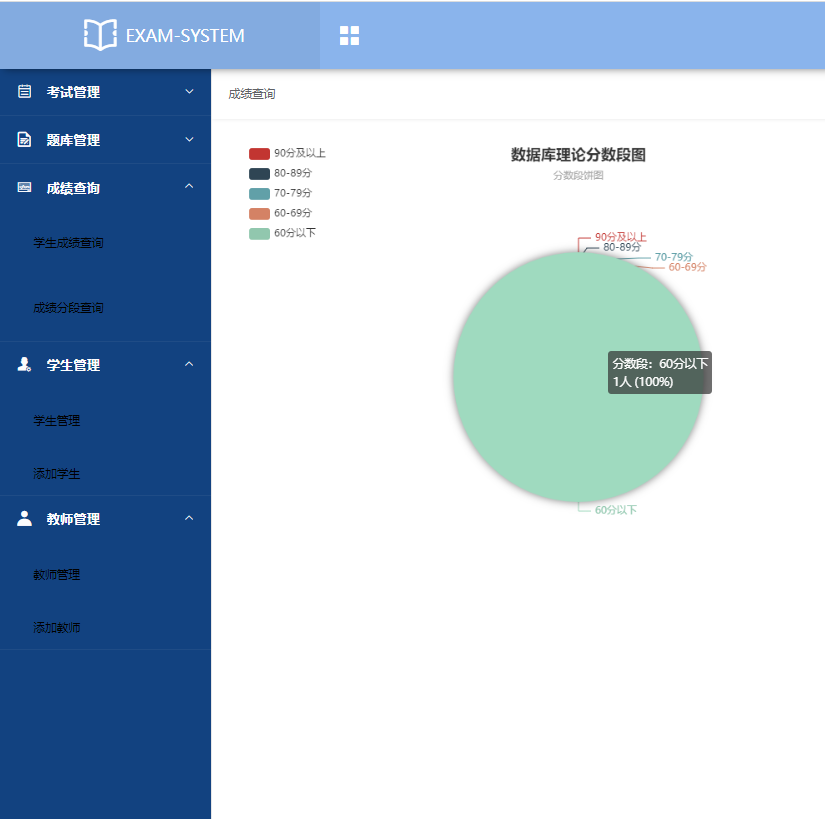

---
### 👉作者QQ ：1556708905 微信：zheng0123Long (支持修改、部署调试、定制毕设)

### 👉接网站建设、小程序、H5、APP、各种系统等

### 👉选题+开题报告+任务书+程序定制+安装调试+ppt 都可以做
---

**毕业设计所有选题地址 [https://github.com/zhengjianzhong0107/allProject](https://github.com/zhengjianzhong0107/allProject)**

**博客地址：[https://blog.csdn.net/2303_76227485/article/details/128661021](https://blog.csdn.net/2303_76227485/article/details/128661021)**

**视频演示：[https://www.bilibili.com/video/BV1YW4y1S76k/](https://www.bilibili.com/video/BV1YW4y1S76k/)**

## 基于Springboot+vue的在线考试系统(源代码+数据库+开题+12000字论文)

## 一、系统介绍

本项目是前后端分离项目，分为管理员、学生、老师三种角色

- 学生：我的试卷、我的练习、我的成绩、修改密码
- 教师：学生管理、试卷管理、题库管理、成绩查询、成绩导出
- 管理员：学生管理、试卷管理、题库管理、成绩查询、教师管理

## 二、所用技术

后端技术栈：

- springboot
- mybatis
- mysql

前端技术栈：

- VUE 
- Element-UI

## 三、环境介绍

基础环境 :IDEA/eclipse, JDK 1.8, Mysql5.7及以上,Node.js（）,Maven

所有项目以及源代码本人均调试运行无问题 可支持远程调试运行

## 四、项目截图

## 五、浏览地址

http://localhost:8088/  

- 管理员账号：9527
- 教师账号：20081001
- 学生账号：20154084
- 密码都是：123456    

## 六、安装教程

1. 使用Navicat或者其它工具，在mysql中创建对应名称的数据库，并执行sql文件夹下的exam.sql文件；
2. 使用IDEA/Eclipse导入项目，若为maven项目请选择maven;导入成功后请执行maven clean;maven install命令，然后运行；
3. 进入src/main/resources修改application.properties里面的数据库配置
4. 启动项目后端项目 
5. vscode打开exam项目，
6. 打开终端，执行npm install 依赖下载完成后执行 npm run dev,执行成功后会显示访问地址
